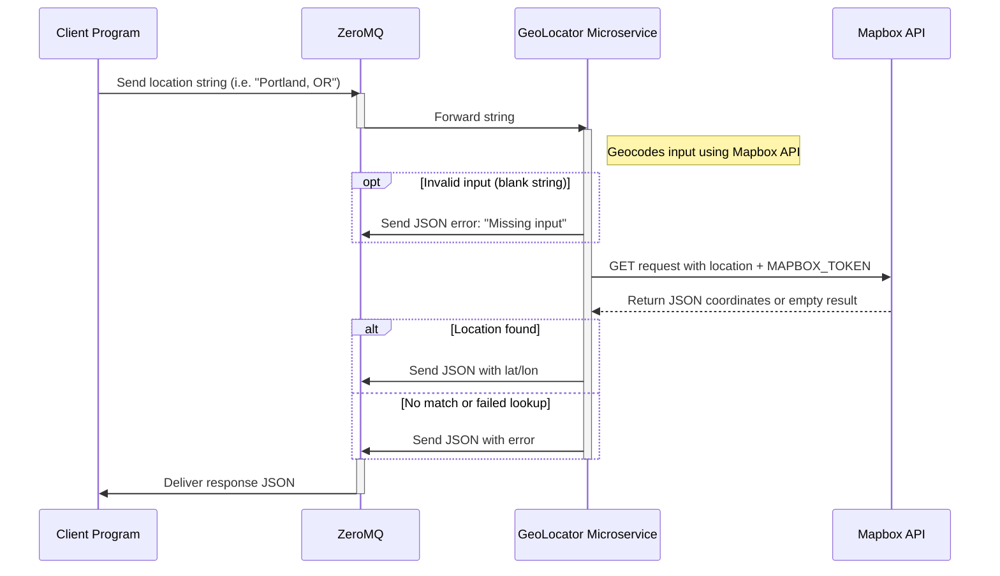

# Geo Locator Microservice

This microservice returns the **latitude and longitude** of U.S. addresses or cities using the [Mapbox Geocoding API](https://docs.mapbox.com/api/search/geocoding/). It communicates using **ZeroMQ** over **port `$PORT_GEOLOCATOR`** (default: `5560`), and is implemented in Python.

---

## Requesting Data

To **request data**, send a plain string using ZeroMQ. The string should represent a valid U.S. location (i.e., `"Portland, OR"` or `"221 NE 122nd Avenue, Portland, OR 97230"`).

### Request Format

```text
"Portland, OR"
```

* Input: a plain string (not JSON)
* Protocol: ZeroMQ `REQ` socket
* Port: `$PORT_GEOLOCATOR` (default: `5560`)

### Example Code (Sending a Request with ZeroMQ in Python)

```python
import zmq

context = zmq.Context()
socket = context.socket(zmq.REQ)
socket.connect("tcp://localhost:5560")

location = "New York, NY"
socket.send_string(location)
```

---

## Receiving Data

The response from the microservice will be a JSON object containing either coordinates or an error message.

### Response Format

#### Valid Example

```json
{
  "lat": 40.7128,
  "lon": -74.0060
}
```

#### Invalid Example

```json
{
  "error": "No result found"
}
```

### Example Code (Receiving a Response)

```python
response = socket.recv_json()

if "error" in response:
    print("Error:", response["error"])
else:
    print("Latitude:", response["lat"], "Longitude:", response["lon"])
```

---

## UML Sequence Diagram


---

## Setup Instructions

### 1. Clone the Repo

```bash
git clone git@github.com:facesnorth/CS361-geo_locator.git
cd CS361-geo_locator
```

### 2. Create a `.env` File

```env
MAPBOX_TOKEN=your_mapbox_token_here
PORT_GEOLOCATOR=5560  # Change to the port of your choosing
```

### 3. Install Dependencies

```bash
pip install python-dotenv requests pyzmq
```

### 4. Run the Microservice

```bash
python3 geo_locator.py
```

You should see:

```text
[GeoLocator] MapBox microservice listening on tcp://*:5560
```

---

## Notes

* Only **U.S. addresses** are supported.
* The service does **not cache** results.
* You **must include** a valid Mapbox API token in `.env`.
* The service listens on port `$PORT_GEOLOCATOR`, defaulting to `5560`.
* Input must be a **non-empty** string. Empty or malformed strings return errors.

---

## Communication Contract & Mitigation Plan

**Teammate:** Purvesh Luhar

**Status:** Implementation complete, pending teammate testing.

**Outstanding Issues:** None.

**Access Instructions:**

* Fork or clone the repository:
  [https://github.com/facesnorth/CS361-geo\_locator](https://github.com/facesnorth/CS361-geo_locator)
* Add your own `.env` file with a valid `MAPBOX_TOKEN`
* Run `geo_locator.py`
* The microservice binds to port `$PORT_GEOLOCATOR` (default: `5560`)

**If You Cannot Access It:**

* DM me on Discord by 8/30 and I’ll respond within 4 hours or less.

**Deadline to Report Issues:**

* Notify me no later than Wednesday, July 30th by 6pm PDT with any major issues, or by Monday, August 4th at 9am PDT with small change requests.

**Additional Notes:**

* To simulate calls, check the example code above or as demonstrated in `test_client.py`, however the code you use must be your own.
* Let me know if you have any questions about setting up the environment variables.

---

## License

This project is licensed under the **MIT License**.
